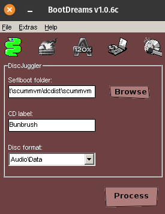

# Bunbrush in Operation Friendship: Dreamcast Port

This directory contains the necessary assets converted for the Dreamcast
release as well as a more up-to-date ScummVM release with the necessary changes to make the game run on Dreamcast.

## Prerequisites

You'll need the following:

- Docker
- [Bootdreams](https://github.com/NaiSan89/BootDreams/releases)

## How to build

- First, follow the [main README's](../README.md) build steps up to and including `make tentacle`.
- Next, we'll have to build the included ScummVM for Dreamcast.
  - CD into `ScummVM` and, ensuring Docker is installed on your system, run `./devtools/docker.sh toolchains/dreamcast`
    to install the Dreamcast toolchain for ScummVM and automatically drop into the container.
  - `scummvm_configure --host=dreamcast  --disable-all-engines --enable-engine=scumm --enable-plugins --default-dynamic`
  - `make dcdist`
  - Copy `tentacle.000`, `tentacle.001` from `game_jam-n64` and all `Track**.mp3` files from this directory to `scummvm/dcdist/scummvm/Bunbrush`
- Finally, we use Bootdreams to master the .cdi.   Point Bootdreams to `scummvm/dcdist/scummvm`, apply the settings according to the following
  screenshot, press `Process` and pick a name and path for the output file.

### Note on Bootdreams on non-Windows systems

Bootdreams will also work in Wine for Linux (macOS should work too, although I haven't tested the procedure on Mac).

Install Bootdreams and drop the [msvbm60.dll](https://www.dll-files.com/download/071cc1df9616290942834a207a76c503/msvbvm60.dll.html?c=U29kMEd5MFJFVXgvV0VlT1VsTnIzZz09)
into the installation folder, as this is missing.

After that you should be able to launch the program by running

`wine [YourWinePath]/drive_c/BootDreams/BootDreams.exe`